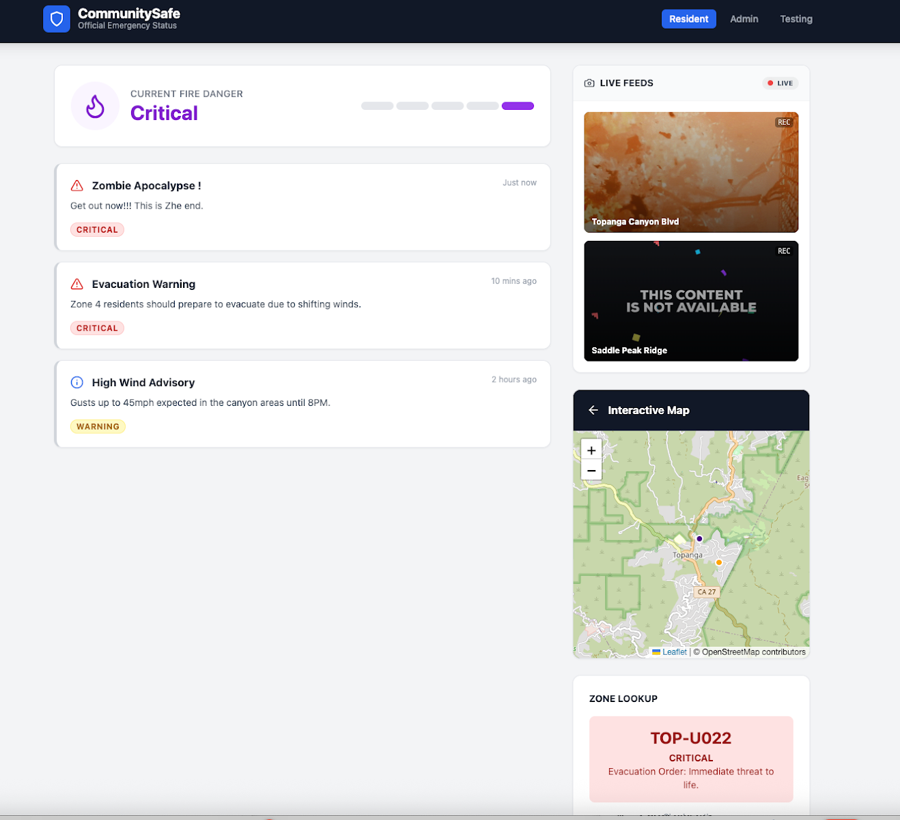
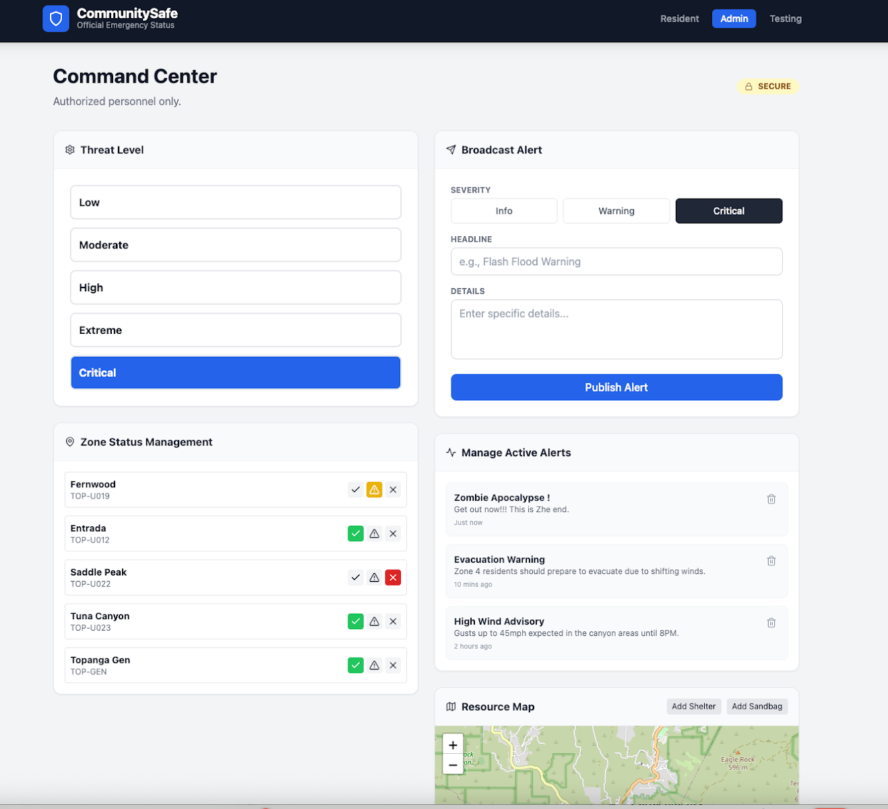
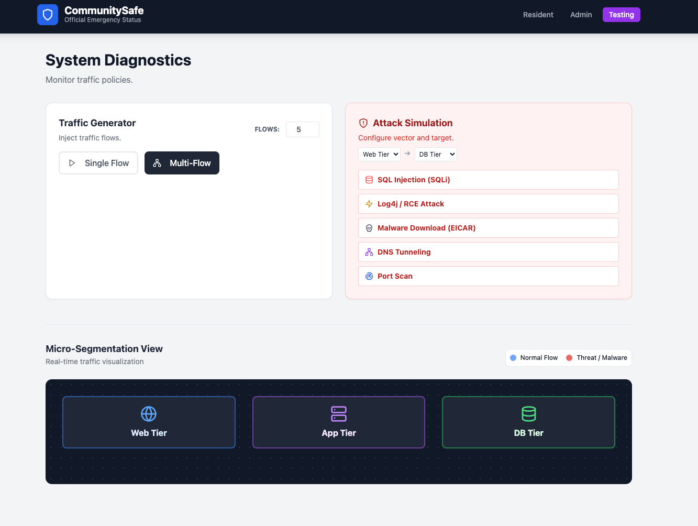

# CommunitySafe: VCF Security Demo Application

**CommunitySafe** is a purpose-built, 3-tier web application designed to demonstrate **VMware vDefend (formerly NSX) Distributed Firewall (DFW)** and **Advanced Threat Prevention (ATP)** capabilities on VMware Cloud Foundation (VCF).

## 📸 Application Tour

### 1. Resident View (Public)
The public-facing portal for residents to view emergency alerts, fire danger levels, and live webcam feeds.

### 2. Admin View (Internal)
The secured console for emergency managers to broadcast alerts, update threat levels, and manage zone evacuation statuses.

### 3. Testing View (Control Plane)
The infrastructure diagnostic tool used to visualize network traffic flows (`Web -> App -> DB`) and inject malicious attack patterns for security testing.

---

## 🎯 Demo Capabilities

### 1. Zero Trust & Micro-segmentation
* **Scenario:** Enforce strict East-West traffic controls.
* **Validation:** The app relies on a strict `Web -> App -> DB` traffic chain. Blocking `Web -> DB` or `App -> DB` ports will visibly break specific features (Alerts, Zone Lookups), providing immediate visual feedback of policy enforcement.

### 2. Advanced Threat Prevention (IDPS)
* **Scenario:** Detect and block malicious traffic signatures without using complex attack tools.
* **Feature:** The built-in **"Threat Generator"** (Testing Tab) launches real HTTP requests containing signatures for:
    * **SQL Injection (SQLi):** `?id=' OR 1=1 --`
    * **Log4j / RCE:** `${jndi:ldap://...}`
    * **DNS Exfiltration:** Tunneling simulation.

### 3. Malware Prevention
* **Scenario:** Prevent malicious file downloads at the Distributed Firewall.
* **Feature:** The **"Malware Sim"** button attempts to download an EICAR test string, triggering NSX Malware Prevention engines.

---

## 📚 Documentation

* **[Deployment Guide](docs/DEPLOYMENT_GUIDE.md):** Step-by-step instructions for deploying the VMs using OVAs or building from source.
* **[vDefend Evaluation Guide](docs/vDefend_Eval_Guide.md):** A structured Proof of Concept (POC) test plan. It maps specific buttons in the "Testing" tab to vDefend capabilities (IDPS, Malware, NDR) with expected outcomes and validation steps.

---

## 🏗 Architecture
The application is deployed as **three lightweight Photon OS VMs**:

| Virtual Machine | Role | OS | Service | Port | Function |
| :--- | :--- | :--- | :--- | :--- | :--- |
| **CommunitySafe-Web** | **Web Tier** | Photon OS 5.0 | Nginx / React | `TCP 80` | Serves Frontend, Proxies API to App Tier. |
| **CommunitySafe-App** | **App Tier** | Photon OS 5.0 | Python API | `TCP 5000` | Business Logic, Queries DB Tier. |
| **CommunitySafe-DB** | **DB Tier** | Photon OS 5.0 | Python DB Sim | `TCP 5432` | Stores Alerts & Zone Data in memory. |

---

## 🚀 Quick Start (OVA Deployment)

**Prerequisites:**
* VMware vCenter / ESXi
* 3 Available IPs (DHCP or Static) on the same segment.

**Installation:**
1.  **Download** the 3 OVA files (`Web`, `App`, `DB`) from the Releases page.
2.  **Deploy** them into your VCF environment.
3.  **Configure Networking:** Ensure all 3 VMs can communicate.
4.  **Link the Tiers:** Update the `/etc/hosts` file on **ALL 3 VMs** to point to each other (See [Deployment Guide](docs/DEPLOYMENT_GUIDE.md)).
5.  **Access:** Open `http://<WEB-VM-IP>` in your browser.
